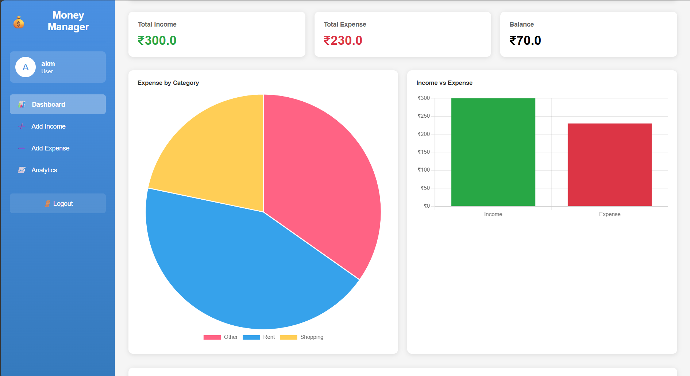

# 💰 Money-Management – Flask Web Application

A full-stack Finance Tracker web application built using **Flask, SQLite, Bootstrap, and Chart.js**.  
This application allows users to manage income and expenses efficiently with authentication and visual analytics.

---

## 🚀 Features

- 🔐 User Registration & Login (Authentication)
- ➕ Add Income
- ➖ Add Expense
- 🗑 Delete Income & Expense
- 📅 Monthly Filter
- 📊 Dashboard with:
  - Total Income
  - Total Expense
  - Balance Calculation
  - Expense Category Chart (Pie Chart)
  - Income vs Expense Chart (Bar Chart)
- 📱 Responsive UI using Bootstrap
- 🔒 Secure password hashing using Werkzeug

---

## 🖼️ ScreenShot

  

---

## 🛠 Tech Stack

- **Backend:** Flask (Python)
- **Database:** SQLite
- **Frontend:** HTML, CSS, Bootstrap
- **Charts:** Chart.js
- **Authentication:** Flask Sessions + Werkzeug Security

---

## 📂 Project Structure
Money-Management/
│
├── app.py
├── database.db
├── requirements.txt
├── README.md
│
├── templates/
│ ├── login.html
│ ├── register.html
│ ├── dashboard.html
│ ├── add_income.html
│ └── add_expense.html
│
├── static/
│ └── style.css
│
└── venv/

---

## ⚙️ Installation & Setup

1. Clone the repository

git clone https://github.com/YOUR_USERNAME/Money-Managemnet.git
cd Money-Management

2.Create virtual environment

python -m venv venv
venv\Scripts\activate

3.Install dependencies
pip install -r requirements.txt

4.Run the Application
python app.py

5.Open in Browser
http://127.0.0.1:5000/

---

⭐ If you found this project useful, consider giving it a star!